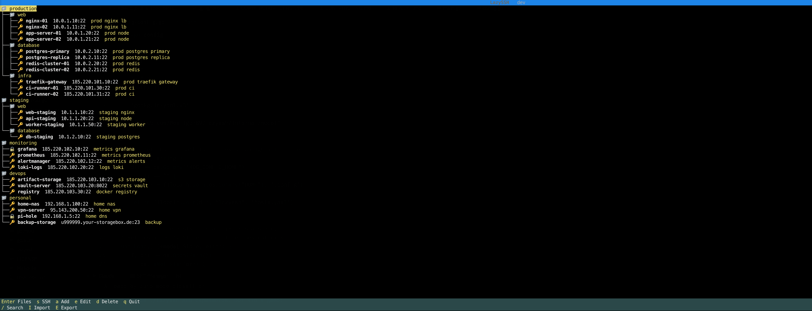
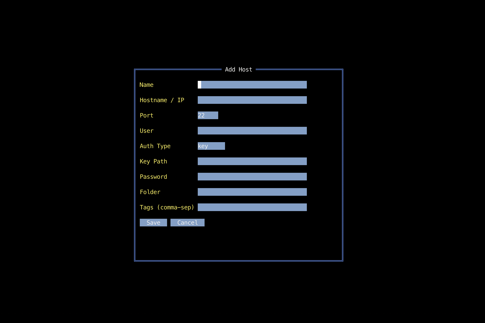
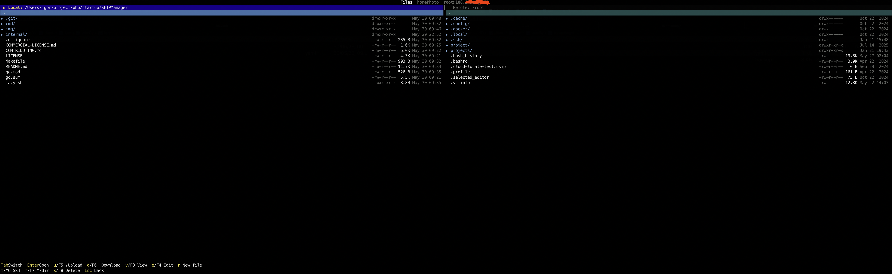

# LazySSH

**A keyboard-driven SSH manager and SFTP file browser for the terminal — inspired by lazygit.**

[](https://golang.org)
[](LICENSE)
[](CONTRIBUTING.md)
[](https://github.com/rivo/tview)

Manage dozens of remote servers from a single terminal window. Organize SSH connections
into nested folders, search instantly, jump into an SSH shell or a dual-pane SFTP
file browser with one keystroke — all without touching your mouse.

---



<p align="center">
  
  &nbsp;&nbsp;
  
</p>

---

## Why LazySSH?

If you manage more than a handful of servers, you have felt the pain: scrolling through
`~/.ssh/config`, maintaining shell aliases, or wrestling with a GUI app that does not
belong in a terminal workflow. LazySSH fixes that.

- **Organized at a glance** — group hosts in nested folders (`prod/web`, `staging/db`, …), add tags, filter with live search. No more scrolling.
- **SSH + SFTP in one place** — open a shell or a dual-pane file browser without leaving the app.
- **Passwords encrypted at rest** — Argon2id key derivation + AES-256-GCM encryption. One master password per session.
- **Zero friction** — a single static binary, one YAML file, no daemon, no cloud sync, no Electron.

---

## Features

### SSH connection manager
- Add, edit, delete hosts via a form-based terminal UI
- Group hosts in **nested folders** (unlimited depth) and **tag** them
- **Live search** by name, hostname, folder, or tag
- Import / export the full host list as a plain YAML file

### One-key SSH terminal
- Press `s` on any host to open a full interactive SSH session
- The TUI suspends cleanly and hands over the terminal to `ssh`; returns when you exit

### Dual-pane SFTP file browser
- Local panel (left) ↔ remote panel (right), keyboard-navigated
- **Upload / download** files and directories — recursive, with a live progress counter and mid-transfer cancel
- **View** files in a built-in scrollable viewer (capped at 512 KB)
- **Edit** any file in `$EDITOR` — for remote files: download → edit → auto re-upload on save
- **Create** files and directories on either panel
- **Delete** with recursive directory removal and confirmation dialogs
- **Open an SSH terminal** without leaving the file browser (`t` / `Ctrl+O`)

### Authentication
- **SSH agent** (`$SSH_AUTH_SOCK`) — tried first, automatically
- **Private key files** — explicit path or standard defaults (`id_ed25519`, `id_rsa`, `id_ecdsa`)
- **Password + keyboard-interactive** — prompted only when needed; if key auth fails LazySSH asks for a password and retries once

### Security
- Passwords stored as `enc:<base64>` — [Argon2id](https://en.wikipedia.org/wiki/Argon2) (t=3, m=64 MB, p=4) for key derivation, AES-256-GCM for encryption
- Master password cached in memory only — never written to disk
- Host keys verified via `~/.ssh/known_hosts`; unknown hosts show a **SHA-256 fingerprint** and require explicit trust (TOFU)
- Host key changes produce a hard error with an MITM warning — no silent downgrade

---

## Install

**From source (recommended):**

```bash
go install github.com/igorivitskyy/lazyssh/cmd/lazyssh@latest
```

**Build manually:**

```bash
git clone https://github.com/igorivitskyy/lazyssh.git
cd lazyssh
make build     # → ./lazyssh
make install   # → $GOPATH/bin/lazyssh
```

**Prebuilt binaries:** planned for the first tagged release.
Follow the [releases page](../../releases) or 👉 [leave a thumbs-up on this issue](../../issues) to signal demand.

**Requirements at runtime:**

| Dependency | Used for |
|---|---|
| `ssh` on `$PATH` | Interactive SSH terminal (`s`, `t`) |
| `$EDITOR` / `$VISUAL` | In-app file editing — falls back to `nano`, `vim`, `vi` |
| `SSH_AUTH_SOCK` | SSH agent (optional, auto-detected) |

---

## Quick start

```
$ lazyssh
```

| Step | Key | What happens |
|---|---|---|
| Add your first host | `a` | Opens the Add Host form |
| Fill in name, hostname, user | — | Port defaults to 22; Auth Type defaults to `key` |
| Save | `Save` button | Host appears in the list |
| Open SSH shell | `s` | SSH session starts immediately |
| Open SFTP browser | `Enter` | Connects and opens the dual-pane browser |
| Quit | `q` | Exits the app |

---

## Configuration

**Config file:** `$XDG_CONFIG_HOME/lazyssh/hosts.yaml`  
Falls back to `~/.config/lazyssh/hosts.yaml`.  
Created automatically on first save. Permissions: `0600` (file), `0700` (directory).

**Example `hosts.yaml`:**

```yaml
version: "1"
hosts:
  # Key-based auth with nested folder and tags
  - id: aae70b507c237a05
    name: web-prod-1
    hostname: 192.168.1.10
    port: 22
    user: deploy
    auth_type: key
    key_path: ~/.ssh/deploy_rsa
    folder: prod/web
    tags: [prod, nginx]

  # Non-standard SSH port
  - id: b1c2d3e4f5a6b7c8
    name: db-prod
    hostname: 192.168.1.20
    port: 2222
    user: root
    auth_type: key
    folder: prod/database

  # Password auth (encrypted when a master password is set)
  - id: c2d3e4f5a6b7c8d9
    name: legacy-box
    hostname: 10.0.0.5
    port: 22
    user: admin
    auth_type: password
    password: enc:base64encodedciphertext==
    folder: legacy
```

**Master password:** the first time you save a host with a password, LazySSH prompts for a master password. That password derives an encryption key via Argon2id and protects the stored credential with AES-256-GCM. It is never persisted — you enter it once per session.

> ⚠️ Without a master password, passwords are stored in plaintext. Set a master password before adding real credentials.

---

## Security details

| Concern | Behaviour |
|---|---|
| Password at rest | Argon2id (t=3, m=64 MB, p=4, 32-byte key) + AES-256-GCM; random salt and nonce per password |
| Master password | Memory-only for the session; never written to disk |
| Host key verification | `~/.ssh/known_hosts` via `golang.org/x/crypto/ssh/knownhosts` |
| Unknown host | SHA-256 fingerprint shown; requires explicit **Trust** |
| Host key change | Hard error + MITM warning; old entry must be removed manually |
| Config permissions | File `0600`, directory `0700` |

---

## Keyboard shortcuts

### Host list

| Key | Action |
|---|---|
| `a` | Add new host |
| `e` | Edit selected host |
| `d` | Delete selected host (confirmation required) |
| `Enter` | Open SFTP file browser |
| `s` / `S` | Launch interactive SSH terminal |
| `/` | Open live search / filter bar |
| `Esc` | Close search bar |
| `I` | Import hosts from a YAML file |
| `E` | Export hosts to a YAML file |
| `q` | Quit |
| `Ctrl+Q` | Quit (alternative) |

### File browser

| Key | Action |
|---|---|
| `Tab` / `Shift+Tab` | Switch active panel (local ↔ remote) |
| `Enter` | Open directory / `..` goes to parent |
| `u` / `U` / `F5` | Upload selected file or directory |
| `d` / `D` / `F6` | Download selected file or directory |
| `v` / `V` / `F3` | View file in built-in viewer |
| `e` / `E` / `F4` | Edit file in `$EDITOR` |
| `n` / `N` | Create new empty file |
| `m` / `M` / `F7` | Create new directory |
| `x` / `X` / `F8` / `Delete` | Delete file or directory |
| `t` / `T` / `Ctrl+O` | Open SSH terminal |
| `Esc` | Disconnect and return to host list |

### File viewer

| Key | Action |
|---|---|
| `↑` `↓` `PgUp` `PgDn` | Scroll vertically |
| `←` `→` | Scroll horizontally |
| `Esc` | Close viewer |

---

## Architecture

```
cmd/lazyssh/        CLI entry point: flags, version, TUI bootstrap
internal/
  model/            Host struct, Store, ID generation
  config/           YAML load/save (0600), Argon2id + AES-GCM crypto, import/export
  ssh/              SFTP client (upload/download/browse/delete, known_hosts TOFU),
                    SSH terminal launcher (shells out to system ssh)
  ui/               tview TUI: host list, host form, dual-pane file browser, modals
```

Strict dependency order: `model` ← `config` ← `ssh` ← `ui` ← `cmd`. Nothing in `internal/` imports from `cmd/`.

---

## Roadmap — come build this with us

LazySSH is used daily and works well. These are the features worth adding — if any of them get you excited, open an issue and let's talk.

**High priority (relatively small scope — great first PRs):**
- [ ] GitHub Actions CI — `go test`, `go vet`, `go build` on every push
- [ ] Prebuilt release binaries via [GoReleaser](https://goreleaser.com) + GitHub Releases
- [ ] Homebrew formula
- [ ] `--help` flag with feature overview

**Medium scope:**
- [ ] Support passphrase-protected private keys (prompt at connect time)
- [ ] Configurable color themes
- [ ] Mouse support (`tview.EnableMouse`)
- [ ] Transfer queue — a panel showing all in-progress uploads and downloads
- [ ] Parallel multi-file transfers

**Larger features:**
- [ ] Port forwarding / SSH tunnel manager
- [ ] Bulk command — run a shell command across all hosts in a folder or tag group
- [ ] Resume interrupted large-file transfers
- [ ] Windows support (mostly terminal-handling differences)
- [ ] i18n / localization

The codebase is ~2 700 lines of idiomatic Go with no framework magic. If you have read a Go struct, you can contribute. **Good first issues are labeled in the issue tracker.**

---

## Similar tools

LazySSH fills a niche between lightweight `~/.ssh/config` managers and full GUI clients.
You might also find these useful:

| Tool | What it is |
|---|---|
| [lazygit](https://github.com/jesseduffield/lazygit) | The original lazy* TUI — for Git |
| [sshs](https://github.com/quantumsheep/sshs) | Terminal UI for `~/.ssh/config` |
| [sshx](https://sshx.io) | Web-based collaborative terminal sharing |
| [Termius](https://termius.com) | GUI SSH client with SFTP (commercial) |
| [FileZilla](https://filezilla-project.org) | GUI SFTP/FTP client |

LazySSH's focus: **keyboard-first, terminal-native, encrypted config, SFTP built in, one binary.**

---

## Contributing

Pull requests are welcome. Read [CONTRIBUTING.md](CONTRIBUTING.md) for the full guide:
dev setup, code style, commit conventions, test instructions, and the list of good first issues.

> **Contributor licensing note:** by submitting a PR you agree your contribution is licensed under PolyForm Noncommercial 1.0.0 and that the project maintainer may include it in commercially-licensed distributions. You retain copyright in your own work.

---

## License

LazySSH is dual-licensed:

- **Free for non-commercial use** under [PolyForm Noncommercial 1.0.0](LICENSE) — personal use, research, education, open-source projects, non-profit organizations.
- **Commercial use requires a paid license.** See [COMMERCIAL-LICENSE.md](COMMERCIAL-LICENSE.md) for details and contact information.

---

## Acknowledgements

Built with excellent open-source libraries:

- [rivo/tview](https://github.com/rivo/tview) — TUI widget framework
- [gdamore/tcell](https://github.com/gdamore/tcell) — terminal cell rendering
- [pkg/sftp](https://github.com/pkg/sftp) — SFTP client
- [golang.org/x/crypto](https://pkg.go.dev/golang.org/x/crypto) — SSH client, known_hosts, Argon2id
- [gopkg.in/yaml.v3](https://gopkg.in/yaml.v3) — config serialization

---

<!-- Search keywords (for indexers):
ssh manager tui, sftp client terminal, keyboard driven ssh, go tui ssh manager,
terminal sftp file browser, lazygit for ssh, ssh connection organizer, remote server manager,
cli ssh manager, ncurses ssh, ssh bookmark manager, sftp tui go, terminal ssh client,
dual pane file manager ssh, scp client terminal, winscp alternative terminal,
ssh connection manager linux mac, ssh manager encrypted, sftp go cli
-->
